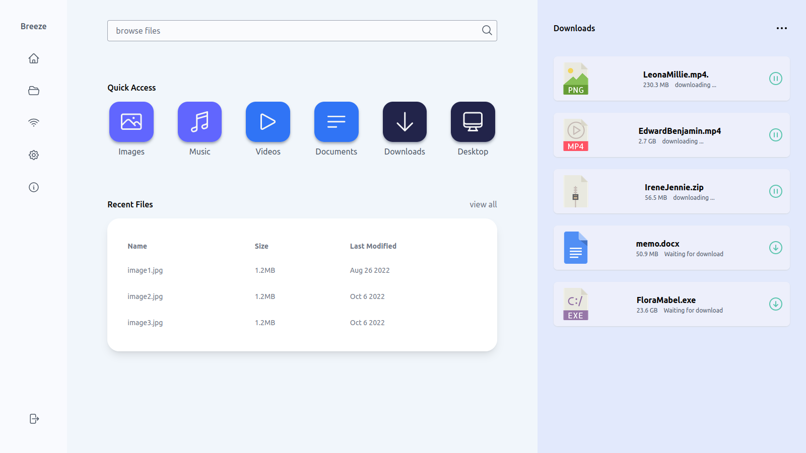

# WiShare: WiFi File Sharing Application

_⚠️ the application is still a work in progress, hence, Some features are missing. Please see the [issues](https://github.com/opeolluwa/send-file/issues) page to contribute_



## Table of Contents

- [Description](#description)
- [Getting Started](#getting-started)
- [Tech Stack](#technology-stack)
- [Features](#features)
- [Acknowledgement](#acknowledgements)
- [Contributing](#contributing)
- [License](#license)

## Description

WiShare is an offline file-sharing application designed for Windows, Mac, and Linux operating systems. It allows users to transfer files seamlessly between PCs over WiFi without an internet connection.

## Getting Started

To run the application in development, you'll need the following dependencies:

- [Node.js](https://nodejs.org) - A JavaScript Runtime environment
- [Yarn](https://yarnpkg.com/) - A fast, secure and reliable package manager for Node.js
- [Rust v1.70 or greater](https://www.rust-lang.org/) - A language empowering everyone
  to build reliable and efficient software.

In addition, this project uses Tauri v1.3, see [prerequisite](https://tauri.app/v1/guides/getting-started/prerequisites/) for your operating system.

Once you have the dependencies installed, clone the project and install the required packages:

```sh
git clone https://github.com/opeolluwa/wi-share.git wi-share
cd wi-share # navigate to the cloned directory
yarn install # install the dependencies
yarn tauri dev # run the application locally

```

## Technology Stack

WiShare is built primarily on the following technologies

- [Tauri](https://tauri.app/) is a framework for building cross-platform desktop applications with front-end web technologies.
- [React](https://react.dev/) - JavaScript library for building user interfaces
- [Next.js](https://nextjs.org/) - React framework for the web
- [Rust](rust-lang.org/) - A language empowering everyone
  to build reliable and efficient software.
- [Typescript](https://typescript-lang.org) - A strongly-typed programming language that builds on JavaScript

- [TailwindCSS](https://tailwindcss.com) - A utility-first CSS framework

## Features

- [x] Adaptive UI
- [x] scan to connect mobile
- [x] build an executable for the Mac operating system
- [x] build an executable for the Linux Operating system
- [ ] create a wifi hotspot
- [ ] build the user interface for mobile devices
- [ ] support dark mode
- [ ] add walkthrough after installation
- [ ] build an executable for Window

## Acknowledgements

- [Linux Wifi Hotspot](https://awesomeopensource.com/project/elangosundar/awesome-README-templateshttps://github.com/lakinduakash/linux-wifi-hotspot)
- [File Streaming](https://github.com/tokio-rs/axum/tree/main/examples/stream-to-file)

## Contributing

Contributions are always welcome!

See [contributing.md](./CONTRIBUTING.md) for ways to get started.

Please adhere to this project's [code of conduct](CODE_OF_CONDUCT.md).

## License

This project is distributed under the [MIT License](./LICENSE)
