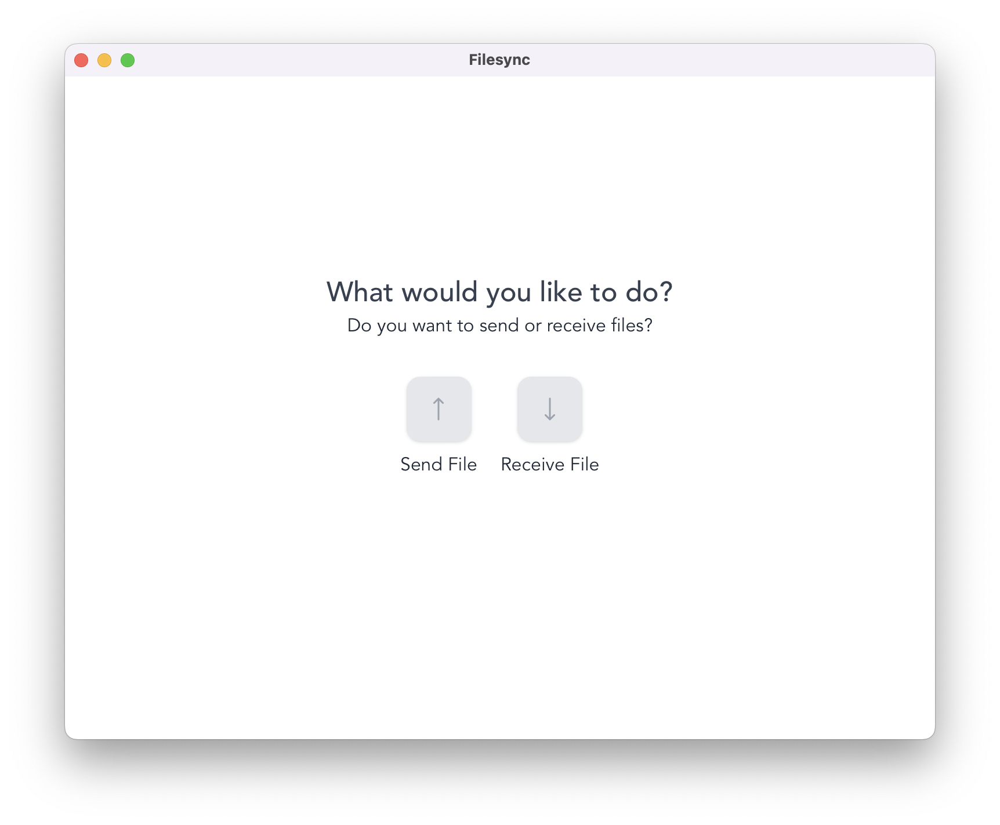
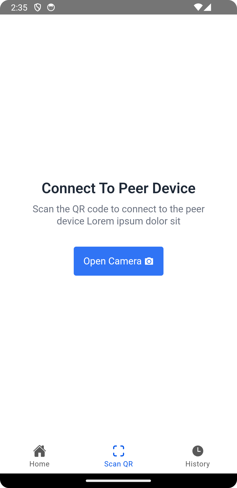

# FIleSync: WiFi File Sharing Application

FileSync is a file-sharing application, targeting Linux, Mac, Windows and
Android platforms 



## Disclaimer

_⚠️ The application is still a work in progress_
To proceed with the preview anyway, see the
[release page](https://github.com/opeolluwa/filesync/releases)_

## Getting Started

### General Requirement

To compile the application or modify it locally, you need the following
dependencies:

- [Rust v1.83 or greater](https://www.rust-lang.org/)'
- [just](https://just.systems/)
- [Android Studio](https://developer.android.com/studio?gad_source=1&gclid=CjwKCAjwnqK1BhBvEiwAi7o0XxODlu3Mk1cb2BoP1HV7g32vB5N37BVL5ab6OJ-3UAfpfkWmBM2nlRoCBfoQAvD_BwE&gclsrc=aw.ds)
  To build and debug the Android application to build reliable and efficient
  software.

Once you have the dependencies installed, clone the project and install the
required packages:

### Workspace Requirements

The project may require some system requirements based on your platform see the
necessary [prerequisite](https://v2.tauri.app/start/prerequisites/) for your
operating system.

```sh
git clone https://github.com/opeolluwa/filesync.git

cd filesync

just install-depenencies
```

### Running the project

To see all available commands

## Roadmap

- [x] Adaptive UI 
- [x] Build an executable for the Mac operating system 
- [x] Build an executable for the Linux Operating system 
- [x] Build an executable for Window 
- [ ] Support mobile devices 
- [ ] Support dark mode
- [ ] Add walkthrough after installation

## Acknowledgments

- [Linux Wifi Hotspot](https://awesomeopensource.com/project/elangosundar/awesome-README-templateshttps://github.com/lakinduakash/linux-wifi-hotspot)
- [File Streaming](https://github.com/tokio-rs/axum/tree/main/examples/stream-to-file)

## Contributing

Contributions are always welcome!

See [contributing.md](./CONTRIBUTING.md) for ways to get started.

Please adhere to this project's [code of conduct](CODE_OF_CONDUCT.md).

## License

This project is distributed under the [MIT License](./LICENSE)
